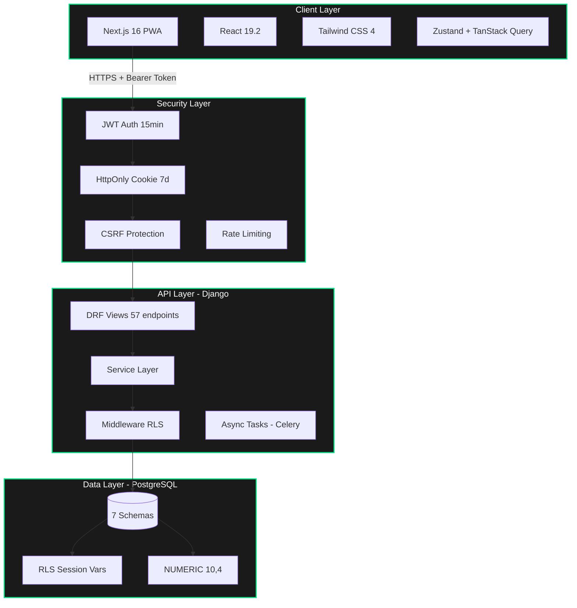
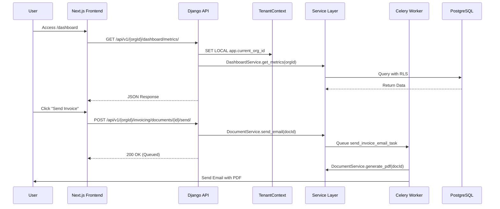

# LedgerSG — Project Architecture Document (PAD)

> **Single Source of Truth for New Developers and Coding Agents**  
> **Version**: 1.1.0  
> **Last Updated**: 2026-02-27  
> **Status**: Production Ready ✅  
> **Scope**: Complete architecture reference for LedgerSG accounting platform

---

## 📋 Table of Contents

1. [Executive Summary](#executive-summary)
2. [System Architecture Overview](#system-architecture-overview)
3. [Project Structure](#project-structure)
4. [Frontend Architecture](#frontend-architecture)
5. [Backend Architecture](#backend-architecture)
6. [Database Architecture](#database-architecture)
7. [API Architecture](#api-architecture)
8. [Security Architecture](#security-architecture)
9. [Development Guidelines](#development-guidelines)
10. [Testing Strategy](#testing-strategy)
11. [Troubleshooting](#troubleshooting)
12. [Quick Start Guide](#quick-start-guide)

---

## Executive Summary

**LedgerSG** is a production-grade, double-entry accounting platform purpose-built for Singapore SMBs. Built with Next.js 16 and Django 6.0.2, it provides comprehensive IRAS 2026 compliance including GST F5 returns, InvoiceNow (Peppol) support, and BCRS deposit handling.

### Current Status

| Component | Status | Version | Key Metrics |
|-----------|--------|---------|-------------|
| **Frontend** | ✅ Production Ready | v0.1.0 | 18 pages, 114 tests |
| **Backend** | ✅ Production Ready | v0.3.1 | 57 API endpoints |
| **Database** | ✅ Complete | v1.0.2 | 7 schemas, 28 tables, 20+ patches |
| **Integration** | ✅ Complete | v0.4.0 | 100% API coverage |
| **Overall** | ✅ Platform Ready | — | WCAG AAA, IRAS Compliant |

---

## System Architecture Overview

### High-Level System Context



### Request Flow Architecture



---

## Project Structure

### Technology Stack

| Layer | Technology | Version | Purpose |
|-------|------------|---------|---------|
| **Frontend** | Next.js | 16.1.6 | App Router, SSG |
| **UI Library** | React | 19.2.3 | Components |
| **Styling** | Tailwind CSS | 4.0 | CSS-first theming |
| **Backend** | Django | 6.0.2 | Web framework |
| **API** | DRF | 3.16.1 | REST endpoints |
| **Auth** | SimpleJWT | Latest | JWT tokens |
| **Database** | PostgreSQL | 16+ | Primary store |
| **Tasks** | Celery + Redis | 5.4+/7+ | Async processing |
| **PDF** | WeasyPrint | 68.1 | Document generation |

---

## Backend Architecture

### Design Principles

| Principle | Implementation | Critical Notes |
|-----------|----------------|----------------|
| **Unmanaged Models** | `managed = False` | Schema is DDL-managed via SQL. No Django migrations. |
| **Service Layer** | `services/` modules | ALL business logic lives in services. Views are thin. |
| **RLS Security** | PostgreSQL session variables | `SET LOCAL app.current_org_id` per request. |
| **Money Precision** | `NUMERIC(10,4)` | Strict precision for IRAS compliance. Rejects floats. |

### Code Pattern: Service Method

```python
from common.decimal_utils import money
from django.db import transaction

class InvoiceService:
    @staticmethod
    def create_invoice(org_id: UUID, data: dict) -> InvoiceDocument:
        """Create invoice with validation and GST calculation."""
        # Validate using money() - rejects floats
        total = money(data['total'])  # Decimal('100.0000')

        with transaction.atomic():
            invoice = InvoiceDocument.objects.create(
                org_id=org_id,
                total=total,
                # ...
            )
            # Create journal entries
            JournalService.post_invoice(org_id, invoice)
        return invoice
```

---

## Database Architecture

### Row-Level Security (RLS)

**CRITICAL**: All queries must include org_id filter or rely on RLS session variable.

```sql
-- Django middleware sets this per request:
SET LOCAL app.current_org_id = 'org-uuid-here';

-- RLS Policy Example
CREATE POLICY org_isolation ON core.organisation
FOR ALL
USING (id = core.current_org_id());
```

### Schema Hardening (Latest Updates)
- **Soft Delete**: All core tables now include `deleted_at` and `deleted_by`.
- **Model Alignment**: Added `account_type` to `coa.account` and `company_name` to `invoicing.contact`.
- **Auth Compatibility**: `core.app_user` contains standard Django fields (`password`, `is_staff`, `is_superuser`).
- **Circular Deps**: Resolved via `ALTER TABLE` constraints at the end of the SQL script.

---

## API Architecture

### Workflow Operations (Live)
```
POST /api/v1/{orgId}/invoicing/documents/{id}/approve/  -- Finalizes invoice & creates journal
POST /api/v1/{orgId}/invoicing/documents/{id}/void/     -- Reverses entries & cancels document
GET  /api/v1/{orgId}/invoicing/documents/{id}/pdf/      -- Returns live-generated PDF binary
POST /api/v1/{orgId}/invoicing/documents/{id}/send/     -- Queues async email delivery with PDF
```

---

## Testing Strategy

### Backend Tests (Unmanaged Database Workflow)

Standard Django test runners fail on unmanaged models because they attempt to run migrations on empty databases.

**Workflow for Verification:**
```bash
# 1. Manually initialize the test database
export PGPASSWORD=ledgersg_secret_to_change
dropdb -h localhost -U ledgersg test_ledgersg_dev || true
createdb -h localhost -U ledgersg test_ledgersg_dev
psql -h localhost -U ledgersg -d test_ledgersg_dev -f database_schema.sql

# 2. Run tests with reuse flags
source /opt/venv/bin/activate
cd apps/backend
pytest --reuse-db --no-migrations
```

---

## Troubleshooting

### Database Issues
- **relation "core.app_user" does not exist**: The test database is empty. Load `database_schema.sql`.
- **AttributeError: 'InvoiceDocument' object has no attribute 'X'**: Check `db_column` mappings in the model. Models must be manually synced with SQL schema changes.
- **DataError: invalid input value for enum**: Django model choices must match PostgreSQL `TYPE ... AS ENUM` exactly (case-sensitive).

---

## Quick Start Guide

### For New Developers

1. **Clone Repository**
   ```bash
   git clone https://github.com/nordeim/ledgersg.git
   cd ledgersg
   ```

2. **Setup Backend**
   ```bash
   cd apps/backend
   source /opt/venv/bin/activate
   pip install -e ".[dev]"
   # Load schema into development DB
   psql -h localhost -U ledgersg -d ledgersg_dev -f database_schema.sql
   python manage.py runserver
   ```

3. **Setup Frontend**
   ```bash
   cd apps/web
   npm install
   npm run dev
   ```

---

**End of Document**
