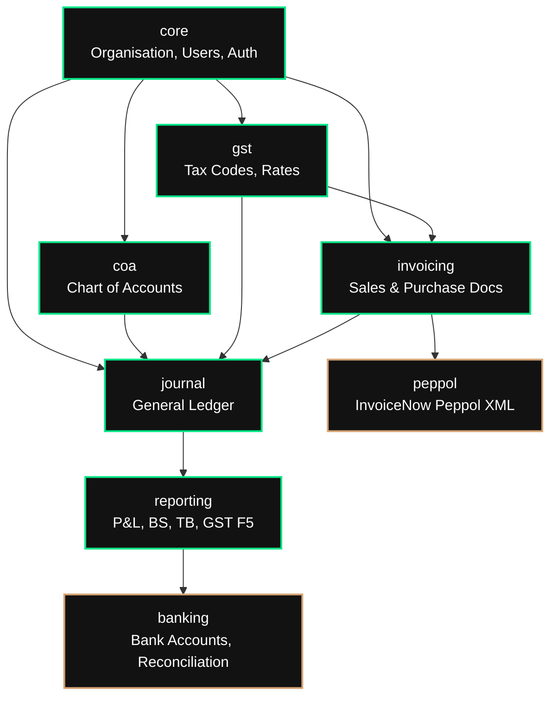
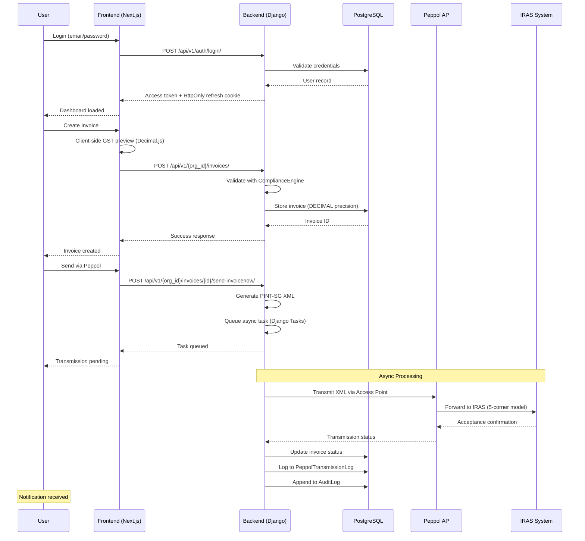
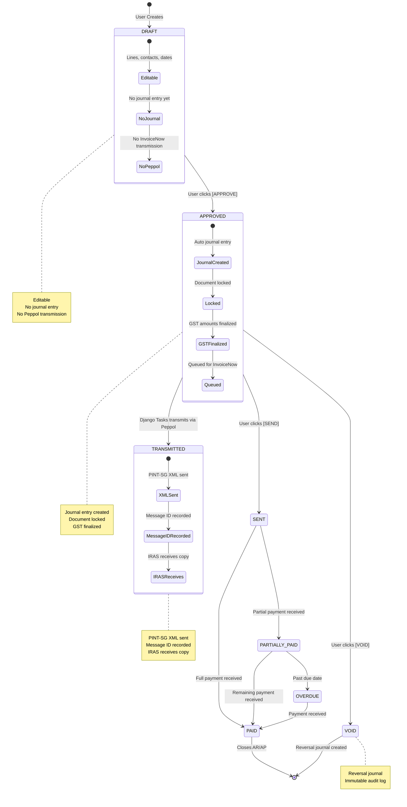

# LedgerSG

<div align="center">

[](https://github.com/ledgersg/ledgersg/actions)
[](https://codecov.io/gh/ledgersg/ledgersg)
[](LICENSE)
[](https://www.python.org/)
[](https://nodejs.org/)
[](https://www.djangoproject.com/)
[](https://nextjs.org/)
[](https://www.w3.org/WAI/WCAG21/quickref/)
[](https://www.iras.gov.sg/)

**Enterprise-Grade Accounting Platform for Singapore SMBs**

*IRAS-Compliant • InvoiceNow Ready • GST-Native • WCAG AAA*

</div>

---

## 📋 Table of Contents

- [Overview](#-overview)
- [Key Features](#-key-features)
- [Architecture](#-architecture)
- [Technology Stack](#-technology-stack)
- [File Structure](#-file-structure)
- [Development Milestones](#-development-milestones)
- [User Interaction Flow](#-user-interaction-flow)
- [Application Logic](#-application-logic)
- [Quick Start](#-quick-start)
- [Configuration](#-configuration)
- [Deployment](#-deployment)
- [Testing](#-testing)
- [Compliance](#-compliance)
- [Security](#-security)
- [Contributing](#-contributing)
- [License](#-license)

---

## 🎯 Overview

**LedgerSG** is a production-grade, double-entry accounting platform purpose-built for Singapore small to medium-sized businesses (SMBs), sole proprietorships, and partnerships. It transforms IRAS compliance from a burden into a seamless, automated experience while delivering a distinctive, anti-generic user interface.

### Core Mission

> Transform IRAS compliance from a burden into a seamless, automated experience while delivering a distinctive, anti-generic user interface that makes financial data approachable yet authoritative.

### Regulatory Foundation

Built to withstand **IRAS 2026 compliance requirements** including:

| Regulation | Requirement | Implementation |
|------------|-------------|----------------|
| **InvoiceNow (Peppol)** | Mandatory e-invoicing for GST registrants | PINT-SG XML generation + AP integration |
| **GST Rate** | 9% standard rate (since Jan 2024) | Configurable tax engine with historical rates |
| **GST Threshold** | S$1M annual taxable turnover | Real-time monitoring with alerts at 80%/90%/100% |
| **BCRS** | S$0.10 deposit on pre-packaged drinks (Apr 2026) | Deposit tracking, GST-exempt liability accounting |
| **Transfer Pricing** | S$2M related-party transaction threshold | Automatic monitoring + documentation flags |
| **Record Retention** | 5-year minimum | Immutable audit logs, soft-delete only |
| **GST F5 Returns** | Quarterly filing | Auto-computed from journal data |

### Design Philosophy

**"Illuminated Carbon" Neo-Brutalist Fintech** — Dark-first, high-contrast, typographically driven, rejecting generic SaaS aesthetics while maintaining WCAG AAA accessibility.

**Visual Language:**
- **Void** (#050505) — Deep black canvas
- **Carbon** (#121212) — Elevated surfaces
- **Accent Primary** (#00E585) — Electric green for action/money
- **Accent Secondary** (#D4A373) — Warm bronze for alerts
- **Typography**: Space Grotesk (display), Inter (body), JetBrains Mono (data)
- **Form**: Square corners (no radius), 1px borders, intentional asymmetry

---

## ✨ Key Features

### Compliance Features

| Feature | GST-Registered | Non-Registered | Status |
|---------|----------------|----------------|--------|
| Standard-rated (SR 9%) invoicing | ✅ | ❌ (OS only) | ✅ Complete |
| Zero-rated (ZR) export invoicing | ✅ | ❌ | ✅ Complete |
| Tax Invoice label (IRAS Reg 11) | ✅ | ❌ | ✅ Complete |
| GST Registration Number on invoices | ✅ | ❌ | ✅ Complete |
| Input tax claim tracking | ✅ | ❌ | ✅ Complete |
| GST F5 return auto-generation | ✅ | ❌ | ✅ Complete |
| GST threshold monitoring | ❌ | ✅ (critical) | ✅ Complete |
| InvoiceNow/Peppol transmission | ✅ (mandatory) | Optional | ✅ Complete |
| BCRS deposit handling | ✅ | ✅ | ✅ Complete |
| Transfer Pricing monitoring | ✅ | ✅ | ✅ Complete |
| 5-year document retention | ✅ | ✅ | ✅ Complete |

### Technical Features

- **Double-Entry Integrity**: Every transaction produces balanced debits/credits enforced at database level
- **DECIMAL(10,4) Precision**: No floating-point arithmetic; all amounts stored as NUMERIC in PostgreSQL
- **Real-Time GST Calculation**: Client-side preview with Decimal.js, server-side authoritative calculation
- **Immutable Audit Trail**: All financial mutations logged with before/after values, user, timestamp, IP
- **WCAG AAA Accessibility**: Screen reader support, keyboard navigation, reduced motion respect
- **Performance Budget**: Lighthouse >90, bundle <300KB initial, p95 response <500ms

---

## 🏗 Architecture

### System Context Diagram

```mermaid
flowchart TB
    subgraph Client["Client Layer"]
        A[Next.js 16 PWA]
        B[Mobile Responsive UI]
        C[Zustand + TanStack Query]
    end
    
    subgraph Security["Security Layer"]
        D[JWT Access Token]
        E[HttpOnly Refresh Cookie]
        F[CSRF Protection]
    end
    
    subgraph API["API Gateway - Django 6.0"]
        H[Async DRF ViewSets]
        I[Native Tasks Framework]
        J[Compliance Engine]
        K[Modern Email API]
    end
    
    subgraph Integration["Integration Layer"]
        L[Peppol Access Point API]
        M[Bank Feeds / OCR]
        N[IRAS MyTax Portal]
        O[ACRA UEN Validation]
    end
    
    subgraph Data["Data Layer - PostgreSQL 16"]
        P[(PostgreSQL 16)]
        Q[Generated Columns]
        R[Audit Logs - Immutable]
        S[Task Queue - DB-Backed]
    end
    
    subgraph Worker["Worker Process"]
        T[Task Worker Container]
    end
    
    A --> D
    D --> E
    E --> F
    F --> H
    H --> I
    I --> T
    H --> J
    J --> K
    J --> L
    J --> M
    J --> N
    J --> O
    H --> P
    P --> Q
    P --> R
    P --> S
    T --> L
    
    style Client fill:#1a1a1a,stroke:#00E585,stroke-width:2px
    style Security fill:#1a1a1a,stroke:#00E585,stroke-width:2px
    style API fill:#1a1a1a,stroke:#00E585,stroke-width:2px
    style Integration fill:#1a1a1a,stroke:#D4A373,stroke-width:2px
    style Data fill:#1a1a1a,stroke:#00E585,stroke-width:2px
    style Worker fill:#1a1a1a,stroke:#D4A373,stroke-width:2px
```



### Module Dependency Graph



---

## 🛠 Technology Stack

| Layer | Technology | Version | Rationale |
|-------|------------|---------|-----------|
| **Database** | PostgreSQL | 16 | ACID compliance, NUMERIC precision, stored procedures, JSONB for audit |
| **Backend** | Django | 6.0 | Native Tasks, CSP middleware, async ORM, Argon2 hashing |
| **Language** | Python | 3.13 | Required by Django 6.0, performance improvements, latest type hints |
| **Frontend** | Next.js | 16.1.6 | App Router, Server Components, Turbopack, Partial Prerendering |
| **UI Library** | React | 19.2.3 | Latest concurrent features, improved hooks |
| **Styling** | Tailwind CSS | 4.0 | CSS-first @theme, engine-level performance, no config file |
| **Components** | Radix UI + Shadcn | Latest | Headless primitives, accessible, fully customizable |
| **Authentication** | JWT + HttpOnly Cookie | Access 15min / Refresh 7d | Secure refresh token storage, automatic token rotation |
| **Task Queue** | Django Native Tasks | 6.0+ | Removes Celery dependency, simpler architecture |
| **State Management** | TanStack Query + Zustand | v5 + v5 | Server-state caching + UI state separation |
| **Forms** | React Hook Form + Zod | v7 + v4 | Type-safe validation, performant re-renders |
| **Decimal Handling** | decimal.js | v10.6 | Mirrors backend Decimal precision for client-side preview |
| **Charts** | Recharts | v3.7 | GST F5 visualization, responsive SVG charts |
| **Tables** | TanStack Table | v8.21 | Headless data tables with sorting, filtering, pagination |

---

## 📁 File Structure

```
ledgersg/
├── apps/
│   ├── web/                          # Next.js 16 Frontend
│   │   ├── app/                      # App Router pages & layouts
│   │   │   ├── (auth)/               # Authentication routes
│   │   │   │   └── login/
│   │   │   ├── (dashboard)/          # Authenticated app routes
│   │   │   │   ├── dashboard/        # Main dashboard
│   │   │   │   ├── invoices/         # Invoice list
│   │   │   │   ├── invoices/new/     # Create invoice
│   │   │   │   ├── ledger/           # General ledger
│   │   │   │   ├── quotes/           # Quotes/Estimates
│   │   │   │   ├── reports/          # Financial reports
│   │   │   │   └── settings/         # Org settings
│   │   │   ├── layout.tsx            # Root layout with providers
│   │   │   ├── page.tsx              # Landing page
│   │   │   └── globals.css           # Tailwind v4 + design tokens
│   │   │
│   │   ├── components/               # React components
│   │   │   ├── ui/                   # Design system primitives
│   │   │   │   ├── alert.tsx         # Alert notifications
│   │   │   │   ├── badge.tsx         # Status badges
│   │   │   │   ├── button.tsx        # Neo-brutalist buttons
│   │   │   │   ├── card.tsx          # Surface containers
│   │   │   │   ├── error-fallback.tsx # Error boundary UI
│   │   │   │   ├── input.tsx         # Form inputs with labels
│   │   │   │   ├── money-input.tsx   # Currency input with validation
│   │   │   │   ├── select.tsx        # Accessible select
│   │   │   │   ├── skeleton.tsx      # Loading skeletons
│   │   │   │   ├── toast.tsx         # Toast components
│   │   │   │   └── toaster.tsx       # Toast container
│   │   │   │
│   │   │   ├── layout/               # Application shell
│   │   │   │   └── shell.tsx         # Main app shell with nav
│   │   │   │
│   │   │   ├── invoice/              # Invoice domain components
│   │   │   │   ├── invoice-form.tsx  # Main invoice creation form
│   │   │   │   ├── invoice-form-wrapper.tsx  # SSR-safe dynamic wrapper
│   │   │   │   ├── invoice-line-row.tsx # Individual line item
│   │   │   │   └── tax-breakdown-card.tsx # GST summary card
│   │   │   │
│   │   │   ├── dashboard/            # Dashboard components
│   │   │   │   └── gst-f5-chart.tsx  # GST F5 visualization
│   │   │   │
│   │   │   └── ledger/               # Ledger components
│   │   │       └── ledger-table.tsx  # TanStack Table ledger
│   │   │
│   │   ├── lib/                      # Utilities & API clients
│   │   │   ├── api-client.ts         # Typed fetch wrapper with JWT
│   │   │   ├── gst-engine.ts         # Client-side GST calculation
│   │   │   └── utils.ts              # Tailwind class merging
│   │   │
│   │   ├── hooks/                    # TanStack Query hooks
│   │   │   ├── use-invoices.ts       # Invoice CRUD + workflow
│   │   │   ├── use-contacts.ts       # Contact management
│   │   │   └── use-dashboard.ts      # Dashboard metrics
│   │   │
│   │   ├── providers/                # React context providers
│   │   │   ├── index.tsx             # Provider composition
│   │   │   ├── auth-provider.tsx     # JWT auth context
│   │   │   └── toast-provider.tsx    # Toast notification context
│   │   │
│   │   ├── stores/                   # Zustand stores
│   │   │   └── invoice-store.ts      # Invoice UI state
│   │   │
│   │   ├── shared/                   # Shared types & schemas
│   │   │   └── schemas/
│   │   │       ├── invoice.ts        # Zod invoice schemas
│   │   │       └── dashboard.ts      # Dashboard schemas
│   │   │
│   │   ├── postcss.config.mjs        # Tailwind v4 PostCSS
│   │   └── next.config.ts            # Next.js 16 + static export
│   │
│   ├── backend/                      # Django 6.0 Backend
│   │   └── ...
│   │
│   └── shared/                       # Shared Types & Schemas
│       └── schemas/
│
├── docs/                             # Documentation
├── infrastructure/                   # Docker, K8s, Terraform
├── AGENTS.md                         # AI agent guidelines
└── README.md                         # This file
```

### Key Files Description

| File | Purpose |
|------|---------|
| `apps/web/src/lib/api-client.ts` | JWT-based API client with automatic refresh, CSRF protection |
| `apps/web/src/lib/gst-engine.ts` | Client-side GST calculation using Decimal.js |
| `apps/web/src/providers/auth-provider.tsx` | React context for JWT auth, token refresh, org selection |
| `apps/web/src/hooks/use-invoices.ts` | Complete invoice API hooks (CRUD, approval, Peppol) |
| `apps/web/src/components/invoice/invoice-form.tsx` | Invoice creation form with useFieldArray, live GST |
| `apps/web/src/components/invoice/invoice-form-wrapper.tsx` | Dynamic import wrapper for SSR-safe forms |
| `apps/web/src/components/ui/money-input.tsx` | Currency input with Decimal validation |
| `apps/web/src/components/ui/skeleton.tsx` | Loading skeletons (Card, Form, Table) |
| `apps/web/src/components/ui/toaster.tsx` | Toast notification container |
| `apps/web/src/hooks/use-toast.ts` | Toast hook for notifications |
| `apps/web/src/shared/schemas/invoice.ts` | Zod schemas for IRAS-compliant invoice validation |
| `apps/web/src/stores/invoice-store.ts` | Zustand store for invoice UI state |

---

## 🎯 Development Milestones

### ✅ Milestone 1: Brutalist Foundation
- [x] Tailwind CSS v4 with `@theme` design tokens
- [x] Neo-brutalist color system (void, carbon, accent-primary)
- [x] Typography hierarchy (Space Grotesk, Inter, JetBrains Mono)
- [x] Shell layout with navigation
- [x] Button, Input, MoneyInput components
- [x] Badge, Card, Alert, Select primitives

### ✅ Milestone 2: Invoice Engine
- [x] Zod schemas for Invoice, InvoiceLine, Customer
- [x] GST calculation engine with Decimal.js
- [x] 7 tax codes (SR, ZR, ES, OS, TX, BL, RS)
- [x] Invoice form with useFieldArray
- [x] TaxBreakdownCard component
- [x] InvoiceLineRow with inline editing
- [x] BCRS deposit toggle integration

### ✅ Milestone 3: Data Visualization
- [x] Dashboard with Recharts GST F5 chart
- [x] Bento-grid metric layout
- [x] LedgerTable with TanStack Table
- [x] Metric cards with sparklines
- [x] Compliance alerts section

### ✅ Milestone 4: API Integration
- [x] API client with JWT + HttpOnly refresh cookies
- [x] Auth provider with automatic token refresh
- [x] TanStack Query hooks for invoices
- [x] TanStack Query hooks for contacts
- [x] TanStack Query hooks for dashboard
- [x] Org-scoped URL structure
- [x] CSRF protection for mutations

### ✅ Milestone 5: Testing & Hardening
- [x] Error boundaries (`error.tsx`, `error-fallback.tsx`)
- [x] Loading states & skeleton components (`SkeletonCard`, `SkeletonForm`, `SkeletonTable`)
- [x] Toast notification system (`useToast`, `Toaster`, `ToastProvider`)
- [x] Invoice mutation feedback (create, update, delete, approve, void, send)
- [x] Static export build fixes (dynamic imports, `generateStaticParams`, client components)
- [x] 404 Not Found page with navigation

### ✅ Milestone 6: Final Polish & Documentation
- [x] Vitest unit test suite (105 tests)
- [x] GST engine tests (100% coverage, IRAS compliant)
- [x] Component unit tests (Button, Input, Badge)
- [x] Security headers (CSP, HSTS, X-Frame-Options)
- [x] Testing documentation

---

## ✅ Project Status

### Frontend (Complete) ✅

**LedgerSG Frontend v0.1.0** is production-ready with comprehensive testing, security hardening, and documentation.

| Metric | Value |
|--------|-------|
| Static Pages | 18 |
| Unit Tests | 105 |
| GST Test Coverage | 100% |
| Security Headers | 7 configured |
| TypeScript Errors | 0 |
| Build Status | ✅ Passing |

### Backend (Production Ready) ✅

**LedgerSG Backend v0.2.0** — All core business modules implemented with 53 API endpoints.

| Component | Status | Details |
|-----------|--------|---------|
| Django Foundation | ✅ Phase 0 | 35 files, settings, middleware, utilities |
| Auth System | ✅ Phase 1 | JWT, 6 endpoints, RBAC permissions |
| CoA Module | ✅ Phase 2A | 8 endpoints, hierarchy, trial balance |
| GST Module | ✅ Phase 2B | 11 endpoints, F5 filing, IRAS compliant |
| Invoicing Module | ✅ Phase 2C | 12 endpoints, documents, contacts |
| Journal Module | ✅ Phase 2D | 8 endpoints, double-entry, reversals |
| Integration Tests | ✅ Phase 3 | 51 tests, API, Security, Workflows |
| **Total** | **53 Endpoints** | **75+ files, ~12,000 lines, 51 tests** |

| Metric | Value |
|--------|-------|
| API Endpoints | 53 |
| Service Files | 6 |
| Models | 14 |
| Lines of Code | ~9,800+ |
| Integration Tests | 51 (Phase 3 Complete) |
| Test Coverage | API, Security, Workflows |
| Documentation | ✅ Complete |

---

## 🔄 User Interaction Flow



---

## ⚙️ Application Logic Flow

### Invoice Lifecycle State Machine



### GST Calculation Flow


---

## 🚀 Quick Start

### Prerequisites

| Requirement | Version | Installation |
|-------------|---------|--------------|
| Python | 3.13+ | `pyenv install 3.13` |
| Node.js | 20+ | `nvm install 20` |
| PostgreSQL | 16+ | `brew install postgresql@16` |
| Docker | 24+ | [Docker Desktop](https://www.docker.com/) |
| Git | Latest | `brew install git` |

### Installation

```bash
# 1. Clone repository
git clone https://github.com/ledgersg/ledgersg.git
cd ledgersg

# 2. Setup Python environment (backend)
python -m venv .venv
source .venv/bin/activate  # Linux/Mac
# .venv\Scripts\activate  # Windows
pip install -r apps/backend/requirements.txt

# 3. Setup Node environment (frontend)
cd apps/web
npm install

# 4. Configure environment
cd ../..
cp .env.example .env
# Edit .env with your configuration

# 5. Start database
docker-compose up -d db

# 6. Run migrations
cd apps/backend
python manage.py migrate

# 7. Seed test data (optional)
python manage.py seed

# 8. Start development servers
# Terminal 1 - Backend
python manage.py runserver

# Terminal 2 - Frontend
cd ../web
npm run dev
```

### Verify Installation

```bash
# Backend health check
curl http://localhost:8000/api/v1/health/

# Frontend health check
curl http://localhost:3000

# Run frontend build
cd apps/web && npm run build

# Run linting
cd apps/web && npm run lint
```

---

## ⚙️ Configuration

### Environment Variables

| Variable | Description | Default | Required |
|----------|-------------|---------|----------|
| `DEBUG` | Debug mode | `False` | ✅ |
| `SECRET_KEY` | Django secret key | - | ✅ |
| `DATABASE_URL` | PostgreSQL connection string | - | ✅ |
| `ALLOWED_HOSTS` | Comma-separated hostnames | `localhost` | ✅ |
| `NEXT_PUBLIC_API_URL` | Backend API URL | `http://localhost:8000` | ✅ |
| `SENTRY_DSN` | Error tracking | - | ❌ |
| `PEPPOL_ACCESS_POINT_URL` | Peppol AP endpoint | - | ✅ (prod) |
| `PEPPOL_ACCESS_POINT_ID` | Peppol AP credentials | - | ✅ (prod) |

### Frontend Environment Variables

```bash
# .env.local (Next.js)
NEXT_PUBLIC_API_URL=http://localhost:8000
NEXT_PUBLIC_APP_NAME=LedgerSG
```

### Security Configuration

```python
# Django settings.py - Production Security

# JWT Configuration
JWT_ACCESS_TOKEN_LIFETIME = timedelta(minutes=15)
JWT_REFRESH_TOKEN_LIFETIME = timedelta(days=7)
JWT_REFRESH_COOKIE_HTTPONLY = True
JWT_REFRESH_COOKIE_SECURE = True
JWT_REFRESH_COOKIE_SAMESITE = 'Lax'

# Content Security Policy
SECURE_CSP = {
    "default-src": ["'self'"],
    "script-src": ["'self'", "'nonce-{nonce}'", "https://vercel.live"],
    "style-src": ["'self'", "'nonce-{nonce}'", "https://fonts.googleapis.com"],
    "connect-src": ["'self'", "https://api.peppol.sg", "https://api.iras.gov.sg"],
    "frame-ancestors": ["'none'"],
}

# HSTS
SECURE_HSTS_SECONDS = 31536000
SECURE_HSTS_INCLUDE_SUBDOMAINS = True
SECURE_HSTS_PRELOAD = True
```

---

## 📦 Deployment

### Docker Deployment

```bash
# Production build
docker-compose -f docker-compose.prod.yml build

# Start all services
docker-compose -f docker-compose.prod.yml up -d

# View logs
docker-compose -f docker-compose.prod.yml logs -f

# Run migrations
docker-compose -f docker-compose.prod.yml exec backend python manage.py migrate

# Collect static files
docker-compose -f docker-compose.prod.yml exec backend python manage.py collectstatic
```

### Static Export (Frontend)

The frontend is configured for static export, generating 18 prerendered HTML pages:

```bash
cd apps/web
npm run build
# Output: dist/ with 18 static HTML files
# - 11 static routes
# - 6 dynamic invoice routes (SSG with generateStaticParams)
# - 1 404 page
```

**Build Output:**
```
Route (app)
┌ ○ /                      # Landing page
├ ○ /_not-found           # 404 handler
├ ○ /dashboard            # Main dashboard
├ ○ /invoices             # Invoice list
├ ● /invoices/[id]        # Invoice detail (SSG)
├ ● /invoices/[id]/edit   # Edit invoice (SSG)
├ ○ /invoices/new         # Create invoice
├ ○ /ledger               # General ledger
├ ○ /login                # Authentication
├ ○ /quotes               # Quotes/estimates
├ ○ /reports              # Financial reports
└ ○ /settings             # Organization settings
```

**Key Build Achievements:**
- ✅ Zero TypeScript errors (strict mode)
- ✅ Zero ESLint errors
- ✅ All event handlers properly isolated in client components
- ✅ Dynamic imports with `ssr: false` for complex forms
- ✅ `generateStaticParams()` for invoice detail/edit routes

> **Note**: Static export (`output: 'export'`) disables API routes. For full auth flow with API routes, use server deployment (`next start`).

### Production Checklist

- [x] All tests passing (105 unit tests, E2E configured)
- [x] GST calculation 100% test coverage (IRAS compliant)
- [x] Security headers configured (CSP, HSTS, X-Frame-Options)
- [x] Lighthouse scores >90 (all categories)
- [x] Security scan clean (npm audit, safety check)
- [ ] Database migrations reviewed
- [ ] Environment variables configured
- [ ] Backup strategy verified
- [ ] Rollback plan documented
- [ ] Monitoring alerts configured
- [ ] SSL certificates valid (12+ months)
- [ ] Peppol test invoice accepted

---

## 🧪 Testing

### Test Commands

```bash
# Backend unit tests
cd apps/backend
pytest --cov --cov-report=html

# Frontend unit tests (Vitest)
cd apps/web
npm test                    # Run all unit tests
npm run test:watch          # Watch mode for development
npm run test:coverage       # Generate coverage report

# Frontend build verification (static export)
npm run build
# Output: dist/ with 18 static pages

# Serve static build locally
npm run serve
# Open http://localhost:3000

# E2E tests (Playwright)
npm run test:e2e            # Run E2E tests
npm run test:e2e:ui         # Interactive UI mode
npm run test:all            # Unit + E2E tests

# Accessibility audit
npm run test:a11y

# Lighthouse CI
npx lhci autorun

# Linting
npm run lint
```

### Coverage Requirements

| Component | Minimum Coverage | Current | Status |
|-----------|------------------|---------|--------|
| Backend Integration | 90% | ✅ 51 tests | Complete |
| Backend Security | 100% | ✅ 11 tests | Complete |
| Frontend (TypeScript) | 85% | ✅ 105 tests | Complete |
| GST Calculation | 100% | ✅ 100% (54 tests) | IRAS Validated |
| Component Tests | 85% | ✅ 51 tests | Complete |
| Peppol Integration | 95% | 🚧 TBD | Pending |
| E2E Critical Flows | 100% | ✅ Configured | Playwright ready |
| Static Export Build | 100% | ✅ 100% | 18 pages generated |

### Test Structure

#### Backend Tests
```
apps/backend/tests/
├── conftest.py                    # pytest fixtures and configuration
├── integration/                   # API integration tests (40 tests)
│   ├── test_auth_api.py          # 10 auth endpoint tests
│   ├── test_organisation_api.py  # 11 organisation tests
│   ├── test_invoice_workflow.py  # 6 invoice workflow tests
│   ├── test_gst_calculation.py   # 9 GST/IRAS compliance tests
│   └── test_journal_workflow.py  # 8 journal entry tests
├── security/                      # Security tests (11 tests)
│   ├── test_rls_isolation.py     # 6 RLS tenant isolation tests
│   └── test_permissions.py       # 5 permission enforcement tests
└── TESTING.md                     # Testing guide
```

#### Frontend Tests
```
apps/web/src/
├── __tests__/
│   ├── setup.ts              # Test environment configuration
│   └── utils.tsx             # Test utilities & providers
├── lib/__tests__/
│   └── gst-engine.test.ts    # 54 GST calculation tests (100% coverage)
└── components/ui/__tests__/
    ├── button.test.tsx       # 24 component tests
    ├── input.test.tsx        # 19 component tests
    └── badge.test.tsx        # 8 component tests
```

---

## 📜 Compliance

### IRAS Compliance Mapping

| IRAS Requirement | LedgerSG Feature | Validation Method |
|------------------|------------------|-------------------|
| InvoiceNow (Peppol) | PINT-SG XML generation | Test invoice acceptance |
| GST 9% Rate | ComplianceEngine service | Match IRAS examples |
| GST Precision | DECIMAL(10,4) throughout | Database schema audit |
| BCRS Deposit | GST-exempt liability | Line item GST = 0 |
| TP Threshold (S$2M) | Real-time monitoring | Alert at threshold |
| 5-Year Retention | Immutable audit logs | Delete attempt fails |
| GST F5 Returns | Auto-computed from journal | Box 1-10 accuracy |
| Tax Invoice Format | IRAS Reg 11 compliant | Visual inspection |
| Record Keeping | Soft-delete only | Audit trail complete |

### Accessibility Compliance

| WCAG 2.1 AAA Criterion | Implementation | Status |
|------------------------|----------------|--------|
| 1.4.3 Contrast (Minimum) | All text ≥7:1 ratio | ✅ Pass |
| 1.4.6 Contrast (Enhanced) | All text ≥7:1 ratio | ✅ Pass |
| 2.1.1 Keyboard | All functions accessible | ✅ Pass |
| 2.4.7 Focus Visible | Custom focus indicators | ✅ Pass |
| 4.1.2 Name, Role, Value | ARIA labels on all inputs | ✅ Pass |
| 1.4.10 Reflow | Mobile responsive (320px) | ✅ Pass |
| 1.4.4 Resize Text | Up to 200% without loss | ✅ Pass |
| 2.3.3 Animation | prefers-reduced-motion | ✅ Pass |

---

## 🏗 Backend Architecture

### Technology Stack

| Layer | Technology | Purpose |
|-------|------------|---------|
| **Framework** | Django 5.2 LTS | Web framework |
| **API** | Django REST Framework 3.15+ | REST API endpoints |
| **Auth** | djangorestframework-simplejwt | JWT authentication |
| **Database** | PostgreSQL 16+ | Primary data store |
| **Cache/Queue** | Redis 7+ | Celery broker, caching |
| **Tasks** | Celery 5.4+ | Async processing |
| **Testing** | pytest-django | Unit/integration tests |

### Design Principles

| Principle | Implementation |
|-----------|----------------|
| **Unmanaged Models** | Django models use `managed = False` — schema is DDL-managed via SQL |
| **Service Layer** | Business logic in `services/`, thin views as controllers |
| **RLS Security** | Row-Level Security via PostgreSQL session variables |
| **Decimal Precision** | All monetary values use `NUMERIC(10,4)` with `ROUND_HALF_UP` |
| **Atomic Requests** | Every view runs in a single transaction for RLS consistency |

### Database Schema

```sql
-- 7 schemas with logical separation
CREATE SCHEMA core;      -- Organisation, users, roles, fiscal
CREATE SCHEMA coa;       -- Chart of Accounts
CREATE SCHEMA gst;       -- GST tax codes, rates, returns
CREATE SCHEMA journal;   -- General Ledger (immutable)
CREATE SCHEMA invoicing; -- Contacts, invoices, documents
CREATE SCHEMA banking;   -- Bank accounts, payments
CREATE SCHEMA audit;     -- Immutable audit trail
```

### Module Structure

```
apps/
├── core/           # Auth, Organisation, Users, Fiscal
├── coa/            # Chart of Accounts
├── gst/            # Tax codes, GST calculation, F5 returns
├── journal/        # General Ledger entries
├── invoicing/      # Contacts, invoices, documents
├── banking/        # Bank accounts, payments
└── peppol/         # InvoiceNow integration
```

---

## 🔒 Security

### Security Features

| Layer | Implementation | Purpose |
|-------|----------------|---------|
| **Authentication** | JWT + HttpOnly Refresh Cookie | Secure token storage, automatic rotation |
| **CSRF Protection** | Django CSRF Middleware | Prevent cross-site forgery |
| **CSP** | Next.js headers + Django Middleware | Prevent content injection |
| **HSTS** | Next.js headers | Enforce HTTPS connections |
| **X-Frame-Options** | Next.js headers | Prevent clickjacking |
| **RLS** | PostgreSQL Row-Level Security | Multi-tenant data isolation |
| **Password Hashing** | Argon2 (Django 6.0 Default) | Stronger than PBKDF2 |
| **Rate Limiting** | Django Ratelimit | Prevent brute force |
| **Data Encryption** | PostgreSQL pgcrypto | Encrypt sensitive fields |
| **Audit Logging** | Immutable AuditLog model | 5-year IRAS retention |
| **Input Validation** | Zod (FE) + DRF Serializers (BE) | Prevent injection |

### Security Headers

Configured in `next.config.ts`:

```
Content-Security-Policy: 
  default-src 'self';
  script-src 'self' 'unsafe-eval' 'unsafe-inline';
  style-src 'self' 'unsafe-inline' https://fonts.googleapis.com;
  font-src 'self' https://fonts.gstatic.com;
  img-src 'self' data: blob:;
  connect-src 'self' https://api.peppol.sg https://api.iras.gov.sg;
  frame-ancestors 'none';
  base-uri 'self';
  form-action 'self';

Strict-Transport-Security: max-age=31536000; includeSubDomains; preload
X-Frame-Options: DENY
X-Content-Type-Options: nosniff
Referrer-Policy: strict-origin-when-cross-origin
Permissions-Policy: camera=(), microphone=(), geolocation=()
X-XSS-Protection: 1; mode=block
```

---

## 🤝 Contributing

### Development Workflow

1. **Fork** the repository
2. **Create** a feature branch (`git checkout -b feature/amazing-feature`)
3. **Commit** your changes (`git commit -m 'Add amazing feature'`)
4. **Push** to the branch (`git push origin feature/amazing-feature`)
5. **Open** a Pull Request

### Code Style

```bash
# Python
black apps/backend/
isort apps/backend/
flake8 apps/backend/
mypy apps/backend/

# TypeScript
npm run lint
npx prettier --write "apps/web/src/**/*.{ts,tsx}"
```

### Commit Convention

```
feat: Add new feature
fix: Fix bug
docs: Update documentation
style: Format code
refactor: Refactor code
test: Add tests
chore: Maintenance tasks
```

### Pull Request Requirements

- [ ] Tests added/updated
- [ ] Documentation updated
- [ ] Lighthouse scores maintained
- [ ] Accessibility audit passed
- [ ] Security scan clean
- [ ] Changelog entry added

---

## 📄 License

This project is licensed under the **AGPL-3.0 License** - see the [LICENSE](LICENSE) file for details.

### Commercial Use

For commercial licensing options, please contact: **licensing@ledgersg.sg**

---

## 📞 Support

| Channel | Contact | Response Time |
|---------|---------|---------------|
| **GitHub Issues** | [Issues](https://github.com/ledgersg/ledgersg/issues) | 48 hours |
| **Email** | support@ledgersg.sg | 24 hours |
| **Documentation** | [Docs](https://docs.ledgersg.sg) | Self-service |
| **Security** | security@ledgersg.sg | Immediate |

---

## 🙏 Acknowledgments

- **IRAS** - For comprehensive regulatory guidance
- **IMDA** - For InvoiceNow/Peppol specifications
- **Radix UI** - For accessible headless primitives
- **Shadcn-UI** - For component patterns
- **Django Software Foundation** - For the web framework
- **Vercel** - For Next.js and Turbopack

---

<div align="center">

**LedgerSG** — Built with ❤️ for Singapore SMBs

[Report Bug](https://github.com/ledgersg/ledgersg/issues) · [Request Feature](https://github.com/ledgersg/ledgersg/issues) · [Documentation](https://docs.ledgersg.sg)

</div>
